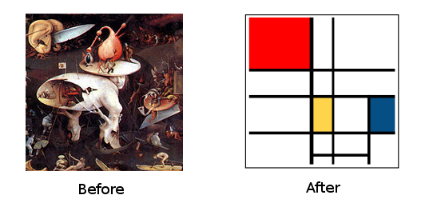
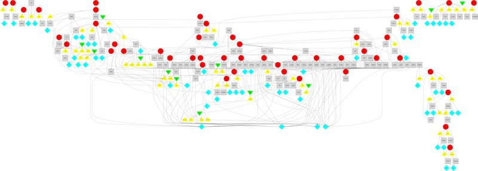
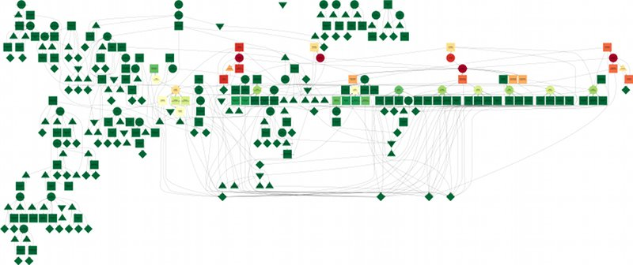
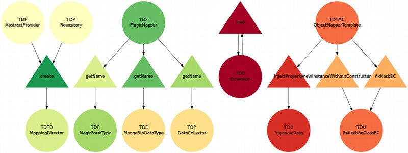

# Mondrian 

Ok guyz, you have a master degree in [Graph Theory][1], you follow [Law of Demeter][2]
and you live on [S.O.L.I.D][3] principles ?

Let's have some Fun ! (^ω^)

## What
It is a set of CLI tools to help you to analyse and refactor highly coupled classes.
As you know Law of Demeter and S.O.L.I.D guidances, you need your classes loosely
coupled. And for this, there is one only rule : **ABSTRACTION**

This app provides some helpers to add abstraction into concrete classes
with minimum pain.

## Example (on DokudokiBundle project)
### Standard

### With centrality (red = more dependent)

### Reduced graph to LSP violations

## How

Read the online documentation [here][4]

And the API [here][5]

## Third party

Packages used in this project :

 * [nikic/php-parser][6]
 * [symfony/console][7]
 * [alom/graphviz][8]
 * [symfony/finder][9]

## Special thanks

 * William Gibson
 * JS Bach
 * Dream Theater

[1]: http://en.wikipedia.org/wiki/Graph_theory
[2]: http://en.wikipedia.org/wiki/Law_of_Demeter
[3]: http://en.wikipedia.org/wiki/SOLID_(object-oriented_design)
[4]: http://trismegiste.github.io/Mondrian/
[5]: http://trismegiste.github.io/Mondrian/doc/index.html
[6]: https://github.com/nikic/PHP-Parser
[7]: https://github.com/symfony/Console
[8]: https://github.com/alexandresalome/graphviz
[9]: https://github.com/symfony/Finder
