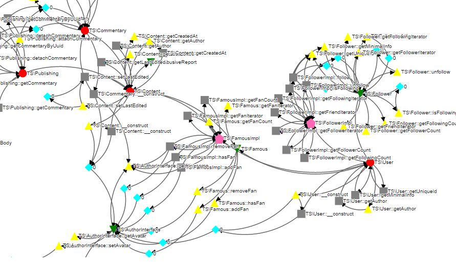

# Mondrian [](https://travis-ci.org/Trismegiste/Mondrian)

Ok guyz, you have a master degree in [Graph Theory][1], you follow [Law of Demeter][2]
and you live on [S.O.L.I.D][3] principles ?

Let's have some Fun ! (^ω^)

## What
It is a set of CLI tools to help you to analyse and refactor highly coupled classes.
As you know Law of Demeter and S.O.L.I.D guidances, you need your classes loosely
coupled. And for this, there is one only rule : **ABSTRACTION**


This app provides some helpers to add abstraction into concrete classes
with minimum pain.

## Getting started
Download the PHAR : [mondrian.phar](https://github.com/Trismegiste/Mondrian/raw/master/bin/box/mondrian.phar)

Try to run a simple command with a few files (or a small part of a project)
```
$ mondrian.phar digraph /home/dev/project
```
This command produces a DOT file for [GraphViz](http://www.graphviz.org). Other formats are available :
* html : interactive graph with the d3.js awesome library
* svg : open standard for vector graphics (requires [GraphViz](http://www.graphviz.org/Download..php))
* json : format for d3.js for example

### Example with html format
```
$ php mondrian.php d --ignore=tests --ignore=vendor --format=html ./MyPhpProject/
```


Note: The generated html file does not require any dependencies nor a connection.

## Ecosystem
Running unit tests with [PHPUnit](https://phpunit.de/getting-started.html)
```
$ phpunit.phar
```

Building the documentation with [phpDocumentor](http://phpdoc.org/docs/latest/getting-started/installing.html#phar)
```
$ phpDocumentor.phar
```

Building mondrian.phar from the sources with [box2](https://github.com/box-project/box2#as-a-phar-recommended)
```
$ box.phar b
```

## Examples
### Default digraph on trismegiste/dokudoki


### Which components are bottleneck ?


### Reduced graph to LSP violations on trismegiste/prolog


## How

Read the concept [here][12]

Read the online documentation [here][4]

And the API [here][5] (not up to date)

## Extensible

You can easily add plugins to this tool to make your own algorithm, coloring scheme
or new generator. I try to make the API mostly decoupled, re-usable and with great
SRP and OCP concerns. Look into the "About" plugin to understand a basic stub of
plugin.

## Third party

Packages used in this project :

 * [nikic/php-parser][6] for parsing PHP
 * [symfony/console][7] for creating CLI app with swag
 * [alom/graphviz][8] for rendering DOT files
 * [symfony/finder][9] for searching files through filesystem
 * [symfony/config][10] for managing yaml configuration without headache
 * [D3.js](http://d3js.org/) for graph rendering in html
 * Phar builded with [Box][11]

## Special thanks

 * William Gibson
 * JS Bach
 * Dream Theater

[1]: http://en.wikipedia.org/wiki/Graph_theory
[2]: http://en.wikipedia.org/wiki/Law_of_Demeter
[3]: http://en.wikipedia.org/wiki/SOLID_(object-oriented_design)
[4]: http://trismegiste.github.io/Mondrian/
[5]: http://trismegiste.github.io/Mondrian/doc/index.html
[6]: https://github.com/nikic/PHP-Parser
[7]: https://github.com/symfony/Console
[8]: https://github.com/alexandresalome/graphviz
[9]: https://github.com/symfony/Finder
[10]: https://github.com/symfony/Config
[11]: https://github.com/kherge/Box
[12]: ./Resources/doc/README.md
