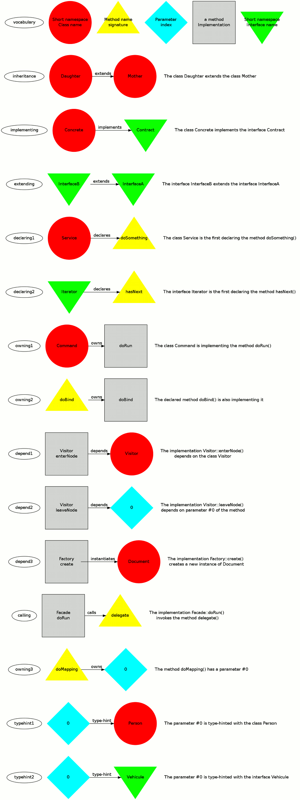

# The digraph language

## It begins with an idea...

All these rules were issued by a painstaking brainstorm based on Demeter's Law, S.O.L.I.D principles
and some other concepts of design patterns.

This tool and its language is designed to show violations of OOP principles with the Graph Theory and algorithms,
that's why there are some weird translations. Remember, this tool is not a way to generate retro-engineered
documentation but an itinerary map through the pitfall-strewn path of refactoring process.

It generates working documents, and they are meant to be thrown after the refactoring :
please, save Amazon rainforest : don't print them ! Instead, use a second viewscreen (full of heavy metals).

## Some explanations

### Signature & implementation
The splitting of method signature and method implementation : in fact the idea is coming from C++ but
it shows the level of abstraction and the spaghetti coupling between concrete components.
If you have interface for each method, there are no longer cycles in the digraph.

### Abstract class
There is no care if a class is abstract or not : it does not matter since I am a proponent
of 'interfaces everywhere' (like Java does) for LSP concerns
(and I think this principle is the best above all because it is the simplest way
for introducing abstraction in source code).

### What about static ?
I don't care if a method is static or not : in fact a static call should generate
2 edges : one to the method and one
to the class. Since this is a spaghetti coupling with the method, I think one link is enough to show
problems. Furthermore, the method is concrete and has a path to the class and I don't want
to confuse with edges representing new instantiations.

### Abstract parameters
Parameters have no name because subclasses can change them, that's why I only keep their indices.

### Trait
Well, I don't care about Trait but I think I'll do in the future. Since a trait don't change the type
of a class, it is as if methods are copy-pasted.
